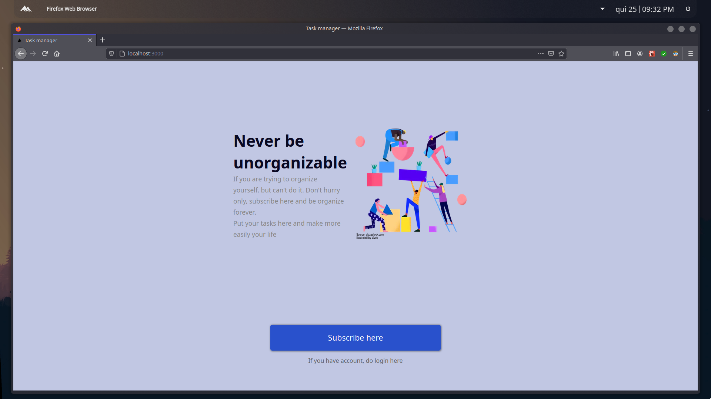
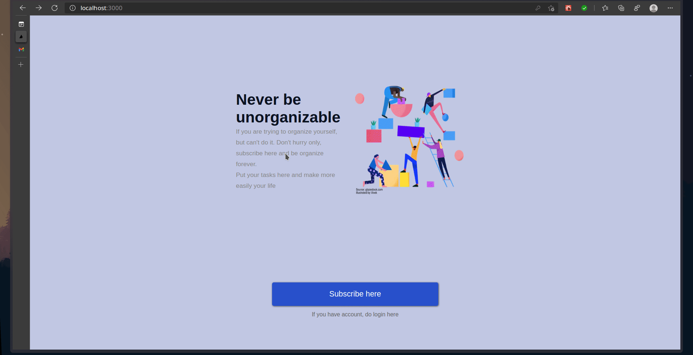
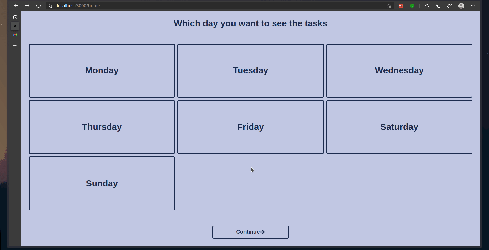

<h1>TaskManager Free</h1>

    

 

    This is a simple project created to show my knowledge about Next.js and PHP with Laravel.
    Task Manager is a free project that allows you to manage your tasks during all day long

    I am learning the tecnologies more modern than we have today (PHP, JavaScript and Typescript). And I want to continue learning more and more, to share my knowledge with another peoples

<h2>Tecnologies useds in this project: </h2>

| Backend | Frontend |
| ------- | -------- |
| Laravel |  Next.js |

<h2>How to run this project ?</h2>

<h3> :clipboard: Things that you will need: </h3>

- PHP (I recommend use PHP 8)
- Composer
- SGBD (I recommend use, Postgres, MySQL or MariaDB)
- Node.js (I recommend use LTS version >= 12)
- NPM
- Yarn (opcional)

<h2> :file_folder: How to run backend: </h2>

- clone the project
- open your terminal
- go inside folder `backend` in this project
- run `composer install`
- after that, run: `(sudo) php artisan serve` 
- the backend will run in: http://localhost:8000

<h2> :globe_with_meridians: How to run frontend</h2>

- first thing first, is execute the steps of backend
- after that, open another terminal
- go inside folder `frontend` in this project
- run `npm install` or `yarn install`
- after that, execute `npm dev` or `yarn dev`
- access web browser and enter in: http://localhost:3000

<h2> Make with :heartbeat: by Gustavo S. Melo </h2>
